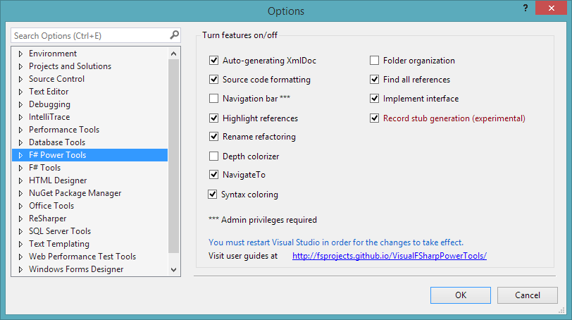
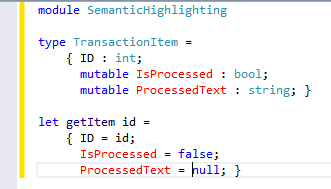
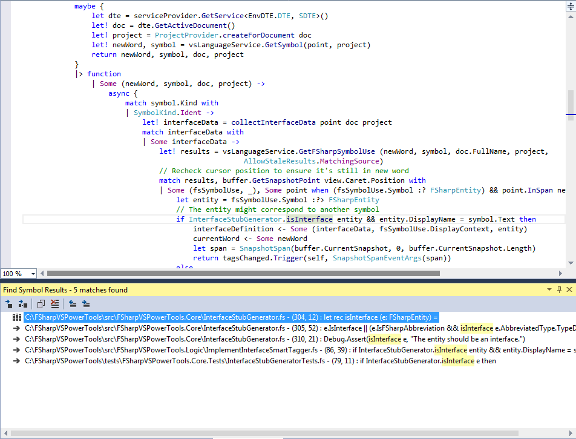
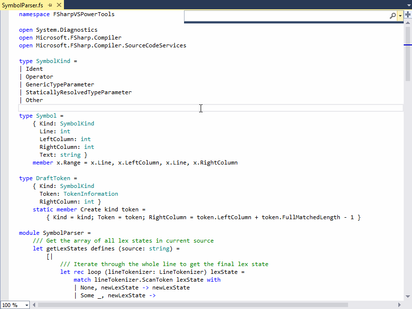

Visual F# Power Tools: community-led tooling for F# in Visual Studio
---

We are pleased to introduce [Visual F# Power Tools](http://visualstudiogallery.msdn.microsoft.com/136b942e-9f2c-4c0b-8bac-86d774189cff), a Visual Studio extension aiming at providing additional tooling for F#.
The goal of the extension is to complement Visual F# Tools by adding missing features such as semantic highlighting, rename refactoring, find all references, etc.
A special thing about [this project](https://github.com/fsprojects/VisualFSharpPowerTools) is that it's a collective effort of F# community where we work alongside with Visual F# Team in order to provide a complete toolset for F# users in Visual Studio.

The extension supports VS2013 and VS2012. In order to install, searching for "FSharp Power Tools" in "Tools --> Extensions and Updates --> Online". You can also download from the [Visual Studio Gallery](http://visualstudiogallery.msdn.microsoft.com/136b942e-9f2c-4c0b-8bac-86d774189cff). The extension consists of a variety of functionalities that may not fit preferences of everyone; therefore, we provide options to tweak it for your own tastes.

This is a relatively young project but we have been receiving positive feedback from F# community. Today we would like to share the story behind the project.

### How did it get started?
There is a vicious circle argument floating around the F# community that a big hurdle for adopting F# is our incomplete tooling story. While we certainly have the best IDE support (in Visual Studio and Xamarin Studio) for a statically-typed functional programming language in the wild, people keep referring to C# support in Visual Studio (plus ReSharper) and expect the same level of F# support before even looking into the language. While we believe that F# is a superior general-purpose language and stands out on its own, there is work to do in tooling area.

After longing for [ReSharper support](http://activemesa.com/fsharper) for [a few years](https://github.com/JetBrains/FSharper) without any hope, we finally attempted to do something about the situation. In the end of January 2014, the project got started. The initial goal was to collect existing F# extensions into single place for curating and maintaining. At times, source code formatting, Xml doc generation and depth colorizer have been used in the community but not actively maintained. 
At the same time, [FSharp.Compiler.Service](http://fsharp.github.io/FSharp.Compiler.Service/)(FCS) came out as a shiny compiler-as-a-service for F#. For those who don't know, FCS is a Roslyn-like compiler where all component of compilation pipeline e.g. lexer, parser, symbols, typed ASTs, assembly generator are exposed for advanced use. FCS gives us wonderful opportunities to not only curate current extensions but also implement many advanced features. We took the chances and many features got implemented naturally. Here is what summed up [our experience](https://twitter.com/fspowertools/status/463573585911885824) in the first three months:

> 3 months, 15 contributors, 700 commits and 5600 downloads. It has been an amazing journey #fsharp #visualstudio.

### Where are we?

Now four months have passed, we would like to look back on a few of our *cool* features.

#### Semantic highlighting
Similar to what C# editor does, we color F# code based on their semantic structures. Beside categories for F# reference types and value types, we provide color categories for modules, functions, quotations, etc. A unique category where we've got many positive responses is one for mutable values and reference cells (see the screenshot below).

Right there, F# community shows how we love immutability by default and is alerted to any use of mutation. We attribute this little feature to all the pains we've been through with mutation prior F#-days.

#### Find all references
This is a feature that once we have, it's really hard to leave without. Putting cursor on any symbol defined in the current solution, `Shift-F12` and boom, all references with detailed navigation information are displayed. 

No more string search, no more browsing manually in order to look for certain symbols. Similarly, we have `Refactor -> Rename` for all symbols defined in current solution. There are ways to improve these features, let us know what you think.

#### NavigateTo
It's one of our most favorite navigational features. If you use Visual Studio 2013, there is [an important improvement](http://blogs.msdn.com/b/visualstudio/archive/2013/07/15/visual-studio-2013-new-editor-features.aspx) where NavigateTo (`Ctrl-``) now delivers results via a non-modal dialog. Just type the identifier you like and you've got all relevant results from projects for quick navigation. Yes, it means that this works seamlessly on mixed F#/C# solutions (see the screencast below).

### What's next?

Recently, we have been working on a few code generation features such as Implement interface Record stub generation, etc. While F# code is very succinct in general, there are situations where contextual code generation could be of tremendous help. For example, we have used Implement interface to dogfood a number of features on the way. The infrastructure for code generation has been done, we hope to get to [resolving open statements](http://vfpt.uservoice.com/forums/247560-general/suggestions/5784677-resolve-unopend-namespace-or-module) soon. Stay tuned for updates.

Another area for improvement is [C# interoperability](http://vfpt.uservoice.com/forums/247560-general/suggestions/5800259-make-find-all-references-rename-refactoring-a) where our features should be aware of referenced C# code. If you would like us to give this a higher priority, please let us know by comments or voting. There have been requests to implement more [refactoring features](http://vfpt.uservoice.com/forums/247560-general/suggestions/5737241-add-extract-method-refactoring). They are indeed challenging and require significant involvement of FCS. But of course, it's fun like the feeling we have since day one of this project.

We are actively seeking for contributors. If you would like to join us, [report bugs](https://github.com/fsprojects/VisualFSharpPowerTools/issues?state=open), [send reviews/suggestions](http://visualstudiogallery.msdn.microsoft.com/136b942e-9f2c-4c0b-8bac-86d774189cff/) or better yet fork the projects and [dive in](https://github.com/fsprojects/VisualFSharpPowerTools/issues?labels=up-for-grabs&page=1&state=open). Together we  make F# tooling better day by day. 